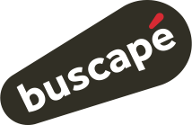
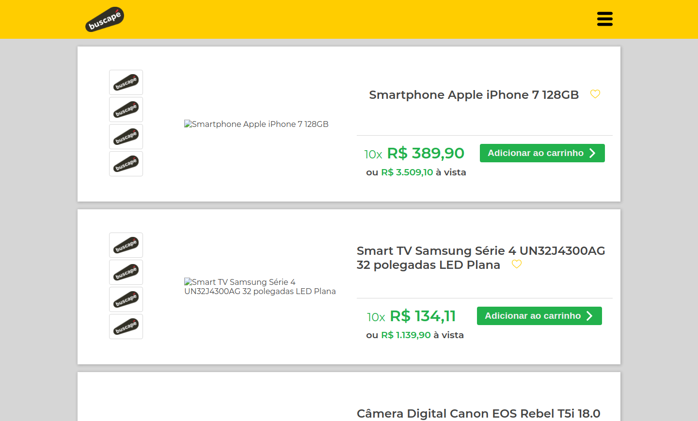
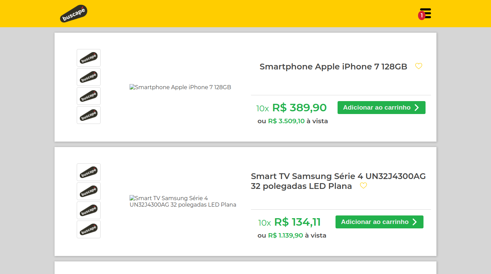
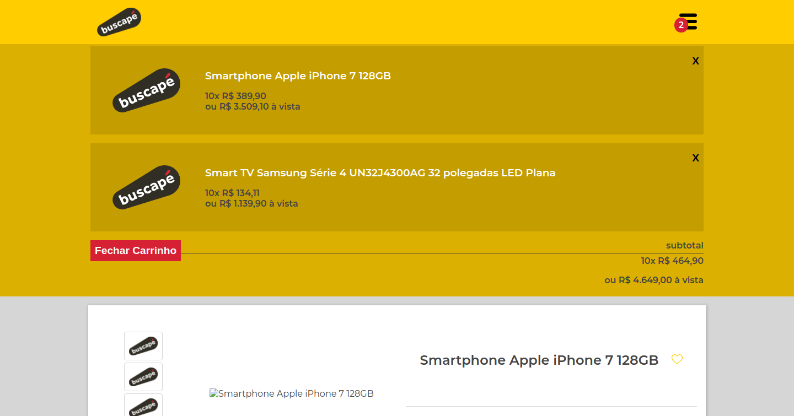

<div align="center" id="top"> 
  
</div>
&#xa0;

<h1 align="center">Challenge Frontend</h1>

## About

This project is a shopping cart to an frontend challenge.

## Screenshots

<div align="center" id="top"> 
  
</div>
<br/>
<div align="center" id="top"> 
  
</div>
<br/>
<div align="center" id="top"> 
  
</div>

## Features implemented

- [x] List of products
- [x] Images gallery
- [x] Add product into the cart
- [ ] Remove product into the cart
- [ ] Responsive layout

- [x] Bonus - Default image for broken images

## Technologies

The following tools were used in this project:

- [React](https://pt-br.reactjs.org/)
- [Sass](https://sass-lang.com/)
- [Axios](https://axios-http.com/)
- [JSON Server](https://github.com/typicode/json-server)

## Requirements

Before starting 🏁, you need to have [Git](https://git-scm.com) and [Node](https://nodejs.org/en/) installed.
<br/>

## Starting

```bash
# Clone this project
$ git clone https://github.com/davi1985/challenge-frontend-buscape

# Access
$ cd challenge-frontend-buscape

# Install dependencies
$ yarn

# Run the server [http://localhost:3333/items]
$ yarn server

# In other terminal tab run the project
$ yarn start

# The server will initialize in the <http://localhost:3000>
```

Made with 💜 by <a href="https://github.com/davi1985" target="_blank">Davi Silva</a>

<a href="#top">Back to top</a>
